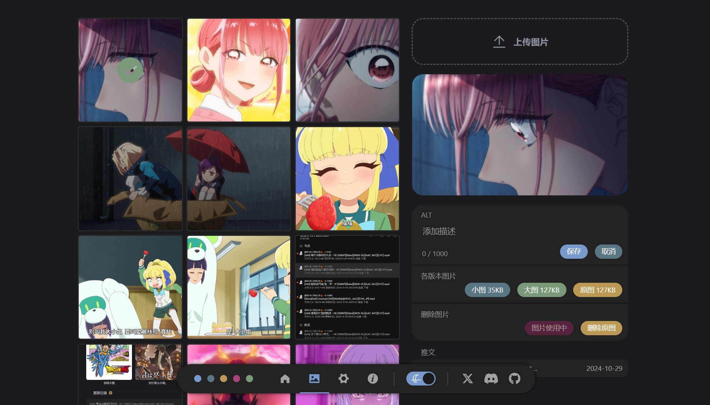

  

<h1 align="center">
  Tweblog
</h1>

  <!-- Vue.js -->
  
  <!-- Hono -->
  
  <!-- Drizzle -->
  
  <!-- Electron -->
  
  <!-- License -->
  <!--  -->
  <!-- GitHub Release -->
  <!--  -->
  <!-- GitHub Activity -->
  <!--  -->
   
  <!-- Discord -->
  
  <!-- Telegram -->
  

Tweblog 是一个社交媒体博客化工具，目的是为了方便同时运营多个社交媒体，自己也在打算用这个从推特出逃。

**Github：** https://github.com/Tweblog/tweblog

<!-- **DockerHub：** https://hub.docker.com/r/harukiowo/tweblog -->
**GHCR：** https://github.com/Tweblog/tweblog/pkgs/container/tweblog

**网站/文档：**
- https://tweblog.sakiko.top/
- https://tweblog.pages.dev/

**预览：** https://haruki.sakiko.top/

**当前版本：** [1.3.0](https://tweblog.sakiko.top/guide/changelog#130)

**技术栈：**
- 前端 TypeScript + Vue3 + ElementPlus
- 后端 TypeScript + Node + Hono
- 数据库 Sqlite + Drizzle

想开始尝试？跳到 [快速开始](https://tweblog.sakiko.top/guide/getting-started)

## ✨ 功能

- 基本功能：发送推文、图片、回复……

- Web版，开箱即用，使用 Docker 部署，可以充当自己的博客

- 桌面版，解压即用，支持 Windows，拥有Web版的全部功能

- 支持对于 X / Twitter 的导入与转发

- 支持对于 Telegram 的导入与转发

- 支持对于 Discord 的导入与转发

- 支持对于 Bluesky 的导入与转发

- ......

## 💡 计划

有谁对任何平台的api熟悉的话，可以帮帮我扩展导入或转发功能吗 👉👈 [扩展指南](https://tweblog.sakiko.top/guide/extension/project) 

- mastodon导入与转发
- xlog导入与转发
- i18n
- 自定义网站简介与开放图谱元标签
- rss
- 动图、音视频支持
- 移动端
- ......

## ☎️ 交流讨论 | 问题反馈

加入 [Discord群组](https://discord.gg/tYXj9ShnVr) [Telegram群组](https://t.me/tweblog)

## 📸 截图

