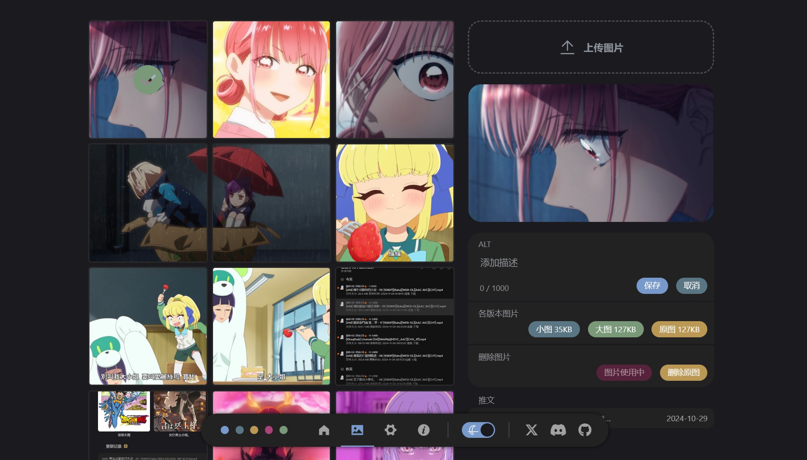

  

  
  
  
  
  
  
  

这个仓库是 Tweblog 的官网/文档，同时作为整个项目的主仓库（如果愿意的话 star 这个仓库就好）
- 网站 https://tweblog.com
- 文档 https://github.com/haruki1953/Tweblog
- 后端 https://github.com/haruki1953/tweet-blog-hono
- 前端1（管理） https://github.com/haruki1953/tweet-blog-vue3
- 前端2（公开） https://github.com/haruki1953/tweet-blog-public-vue3

# Tweblog

是一个自部署的微博客，目的是为了方便同时运营多个社交媒体，自己也在打算用这个从推特出逃。

**预览：** https://haruki.sakiko.top/

**当前版本：** [0.0.2](https://tweblog.com/guide/changelog#002)

**技术栈：**
- 前端 TypeScript + Vue3 + ElementPlus
- 后端 TypeScript + Node + Hono
- 数据库 Sqlite + Prisma

想开始尝试？跳到 [快速开始](https://tweblog.com/guide/getting-started)

## 功能

- 基本功能：发送推文、图片、回复……

- 支持对于 X / Twitter 的导入与转发

- web版，可以充当自己的博客

- ……

## TODO
有谁对任何平台的api熟悉的话，可以帮帮我扩展导入或转发功能吗 👉👈 [扩展指南](https://tweblog.com/guide/extension/project) 

- 桌面版（锐意制作中）
- discord导入与转发
- xlog导入与转发
- bluesky导入与转发
- mastodon导入与转发
- telegram导入与转发
- i18n
- rss
- 动图、音视频支持
- 移动端

## 交流讨论 | 问题反馈
加入 [discord群组](https://discord.gg/tYXj9ShnVr)

## 预览

---

---

---

---

---

