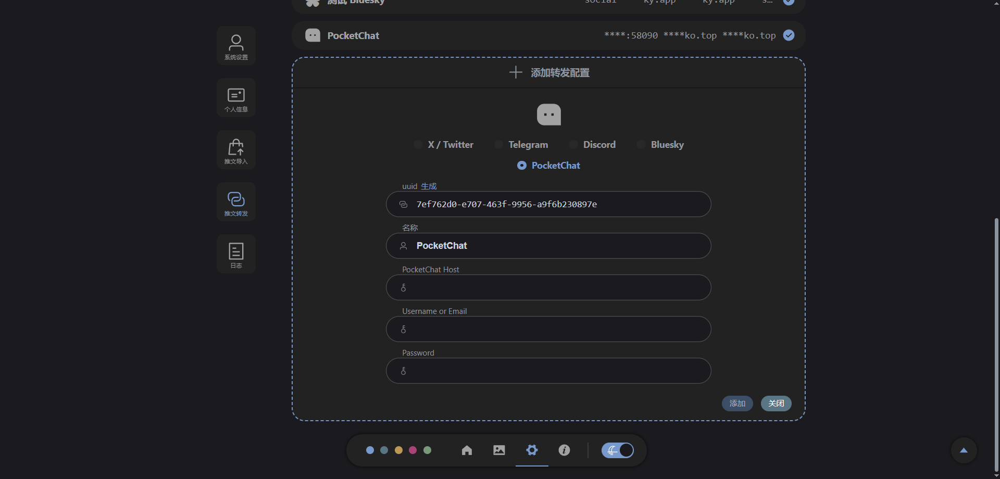

# PocketChat 转发配置 <Badge type="tip" text="1.5.0" />


- **PocketChat Host** ：如 `https://sakiko.top`
```
PocketChat Host 即 PocketChat 网站地址

提示：网址最后的斜杠加不加都没关系，都能正确执行
```


- **Username or Email** ：自己 PocketChat 账号的用户名或邮箱

- **Password** ：自己 PocketChat 账号的密码

## 关于 PocketChat
- PocketChat 是一个基于 [PocketBase](https://github.com/pocketbase/pocketbase) 与 [Vue3](https://github.com/vuejs/vue) 的开源实时聊天平台。
- 项目地址 https://github.com/PocketTogether/pocket-chat
- 预览 https://sakiko.top
