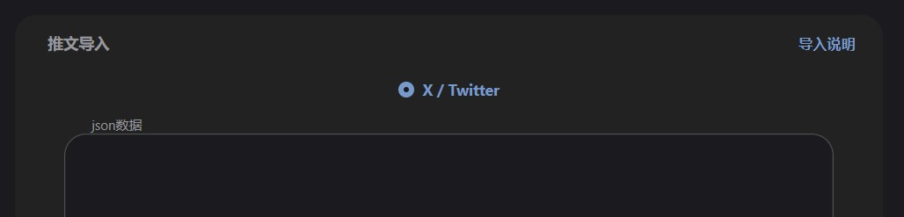
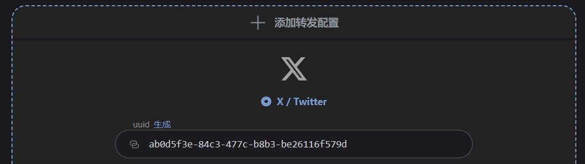

# 项目说明

- 后端 https://github.com/haruki1953/tweet-blog-hono
- 前端1（管理） https://github.com/haruki1953/tweet-blog-vue3
- 前端2（公开） https://github.com/haruki1953/tweet-blog-public-vue3

## 后端启动
```sh
# 安装项目依赖
pnpm install

# 生成Prisma Client
pnpm prisma generate

# 将Prisma schema推送到数据库，创建数据库
pnpm prisma db push

# 启动开发服务器
pnpm dev
```

开发服务器将运行在 3000 端口

## 前端启动
```sh
pnpm install
```

在启动前，需要改一下接口路径配置
```ts
// src\config\config.ts

// 启用
// 开发时使用的
const apiBaseUrl = 'http://localhost:3000/api/'
const staticBaseUrl = 'http://localhost:3000/'

// 注释掉
// // 部署时，将由后端来托管前端，设置为根路径
// const apiBaseUrl = '/api/'
// const staticBaseUrl = '/'
```

```sh
pnpm dev
```

## docker打包
将两个前端的接口路径配置正确，之后打包前端
```sh
# tweet-blog-vue3
# tweet-blog-public-vue3
pnpm build
```

打包后的 `tweet-blog-public-vue3/dist` 中的全部文件复制至后端 `tweet-blog-hono/static`，
打包后的 `tweet-blog-vue3/dist` 中的全部文件复制至后端 `tweet-blog-hono/static/admin`

然后需要修改 Dockerfile ，代理设置需要根据自己的情况修改或删除（有两处）
```Dockerfile
# 设置代理
ENV http_proxy=http://192.168.2.110:10811/
ENV https_proxy=http://192.168.2.110:10811/
```

之后在后端 `tweet-blog-hono` 所在目录进行打包，自己决定一下镜像名和版本
```sh
# 构建
docker build -t tweblog-xxx:0.0.0 .

# 运行
docker run -d \
	--name Tweblog \
	-v ${HOME}/Tweblog/data:/app/data \
	-p 51125:51125 \
	--restart unless-stopped \
	tweblog-xxx:0.0.0

# 查看日志
docker logs Tweblog
```

## platform.ts 说明

::: details 导入和转发功能，都通过 platform.ts 来控制平台信息
```ts
/*
  此文件在前后端中内容一致
  前端：src\config\platform.ts
  后端：src\configs\platform.ts

  对于推文导入（解析）的主要逻辑在前端：
    src\views\control\views\tweet-import\services\process.ts
  对于推文转发的主要逻辑在后端：
    src\services\post-control\control-forward\forward-post\forward-post.ts
*/

import { z } from 'zod'

// 转发配置中，各平台所对应的 data 数据结构
// X / Twitter
const forwardSettingDataSchemaX = z.object({
  'API Key': z.string(),
  'API Key Secret': z.string(),
  'Access Token': z.string(),
  'Access Token Secret': z.string()
})
// data 数据例，前端要用
const forwardSettingDataDefaultX: z.infer<typeof forwardSettingDataSchemaX> = {
  'API Key': '',
  'API Key Secret': '',
  'Access Token': '',
  'Access Token Secret': ''
}
// 用于测试
const forwardSettingDataSchemaT = z.object({
  token: z.string()
})
const forwardSettingDataDefaultT: z.infer<typeof forwardSettingDataSchemaT> = {
  token: ''
}
// 全部平台的 forwardSettingDataDefault
export const forwardSettingDataDefaultAll = {
  ...forwardSettingDataDefaultX,
  ...forwardSettingDataDefaultT
}

// 关于导入与导出所需的平台数据
export const platformKeyMap = {
  X: {
    key: 'X',
    name: 'X / Twitter',
    fontawesomeClass: 'fa-brands fa-x-twitter',
    // 是否支持导入或导出，这个会控制对应 radio 单选框
    couldImport: true,
    couldForward: true,
    // 转发配置中，data 的 schema 与 默认值
    forwardSettingDataSchema: forwardSettingDataSchemaX,
    forwardSettingDataDefault: forwardSettingDataDefaultX
  },
  T: {
    key: 'T',
    name: 'Test',
    fontawesomeClass: 'fa-brands fa-font-awesome',
    couldImport: false,
    couldForward: false,
    forwardSettingDataSchema: forwardSettingDataSchemaT,
    forwardSettingDataDefault: forwardSettingDataDefaultT
  }
} as const
// 这个手动写出来的原因是，zod枚举需要字面量类型数组
export const platformKeyEnum = ['X', 'T'] as const

// 类型检查以确保 platformKeyEnum 与 platformKeyMap 的值是同步的
export type PlatformKeyMapValues =
  | (typeof platformKeyMap)[keyof typeof platformKeyMap]['key']
  | keyof typeof platformKeyMap
export type PlatformKeyEnumValues = (typeof platformKeyEnum)[number]
// eslint-disable-next-line @typescript-eslint/no-unused-vars
const platformKeyMapTest: PlatformKeyMapValues[] = [] as PlatformKeyEnumValues[]
// eslint-disable-next-line @typescript-eslint/no-unused-vars
const platformKeyEnumTest: PlatformKeyEnumValues[] =
  [] as PlatformKeyMapValues[]
```
:::

### forwardSettingData

关于 `forwardSettingDataSchemaX` 与 `forwardSettingDataDefaultX` ，是在转发配置中所需要的。

注意：如果要扩展导入功能，虽然对于扩展导入功能来说没有用，但为了保证 `platformKeyMap` 的类型正确，需要模仿着创建一个

### platformKeyMap

关于 `platformKeyMap` ，请确保每个平台的键 (如 "X") 与其内部 key 属性的值保持一致。

关于 `platformKeyMap` 中的 `fontawesomeClass` ，是 fontawesome 图标所需的类名 https://fontawesome.com/v6/search?o=v&ic=brands

关于 `platformKeyMap` 中的 `couldImport` 和 `couldForward` ，将用于控制前端 推文导入/转发配置 中的平台单选框的显示。

```vue
<!-- tweet-blog-vue3: src\views\control\views\tweet-import\components\ImportProcess.vue -->
<el-radio-group v-model="platform">
  <template v-for="key in platformKeyEnum" :key="key">
    <el-radio :value="key" v-if="platformKeyMap[key].couldImport">
      {{ platformKeyMap[key].name }}
    </el-radio>
  </template>
</el-radio-group>

<!-- tweet-blog-vue3: src\views\control\views\forward-config\components\ForwardSettingFormAdd.vue -->
<el-radio-group v-model="item.platform" @change="onPlatformChange">
  <template v-for="key in platformKeyEnum" :key="key">
    <el-radio :value="key" v-if="platformKeyMap[key].couldForward">
      {{ platformKeyMap[key].name }}
    </el-radio>
  </template>
</el-radio-group>
```



---


