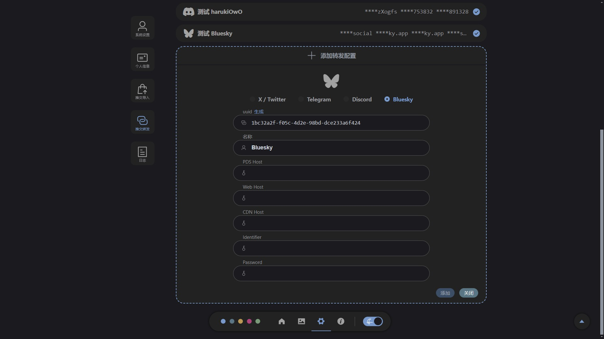
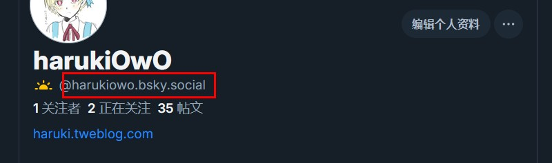

# Bluesky 转发配置 <Badge type="tip" text="1.3.0" />


- **PDS Host** ：如 `https://bsky.social`
```
PDS Host 是 Bluesky 社交网络中用于存储和管理你个人数据的服务器地址。
通常情况下，可以使用默认的 https://bsky.social 作为 PDS Host。
如果不确定该填写什么，直接使用这个默认地址即可。

提示：网址最后的斜杠加不加都没关系，如 https://bsky.social/
```

- **Web Host** ：如 `https://bsky.app`
```
Bluesky 网站的地址，用于拼接帖子链接
```

- **CDN Host** ：如 `https://cdn.bsky.app`
```
Bluesky 图片的地址，用于拼接图片链接
可以在任意图片上右键点击并 新建标签页打开图像，图片的链接为：
https://cdn.bsky.app/img/feed_thumbnail/plain/did:plc:fju6cv4shmqbymfqc7jvzkya/bafkreihvofxar3cieoturpy2yeypdd7yvtytdoorgrv4by6zmncl3ymvqu@jpeg
https://cdn.bsky.app 即为 CDN Host
```

- **Identifier** ：自己账号的ID，如 `harukiowo.bsky.social`
    

- **Password** ：自己账号的密码