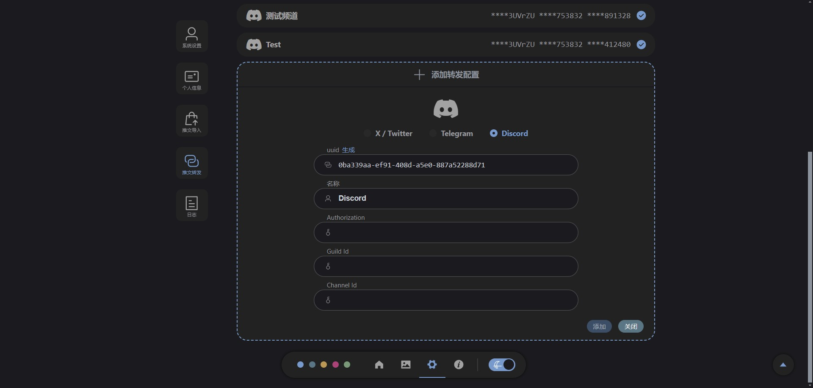
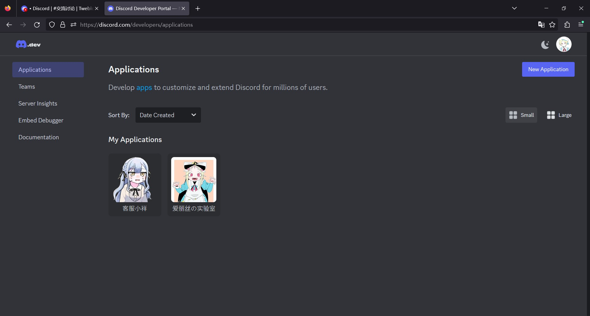
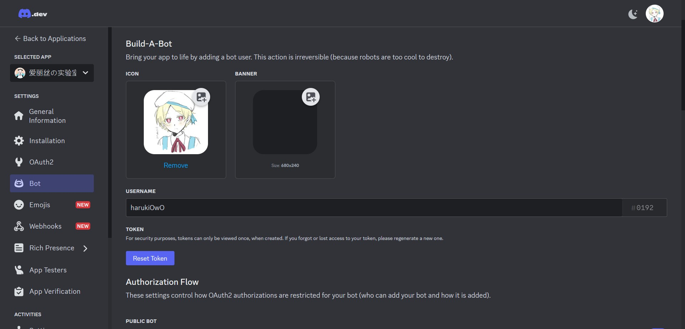
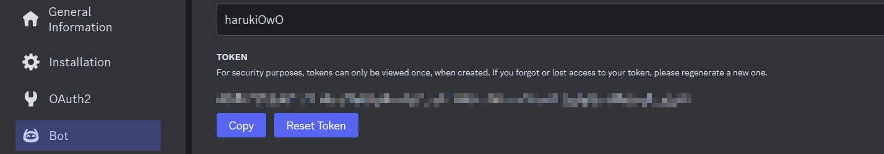
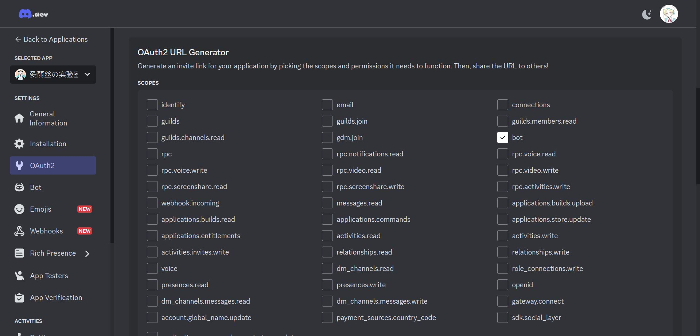
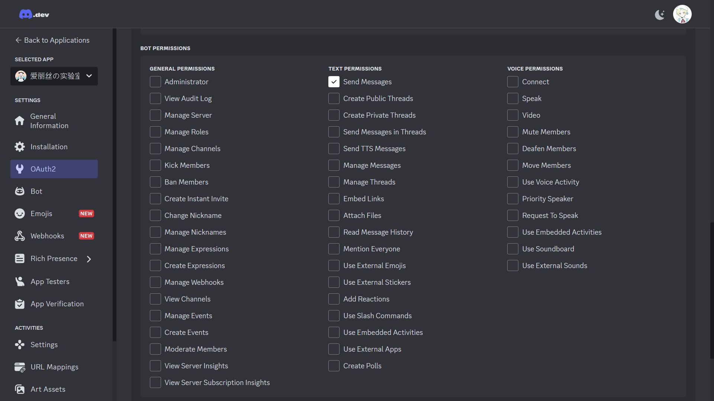
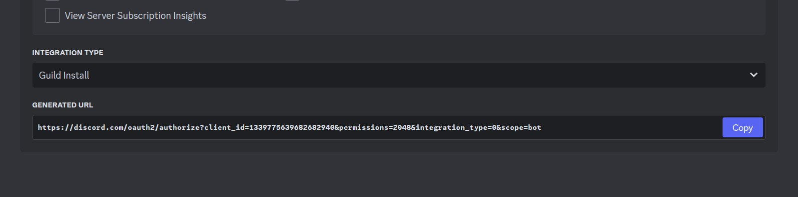
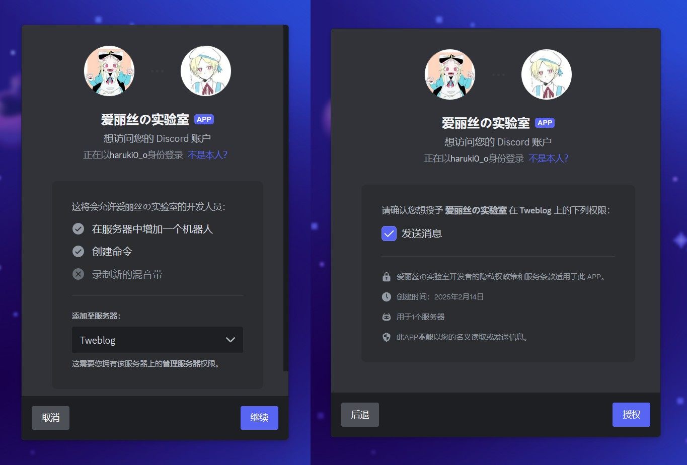
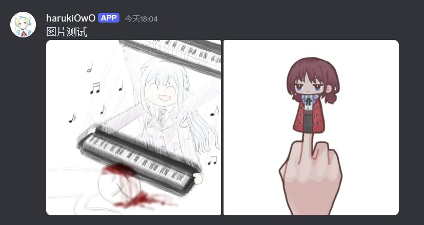
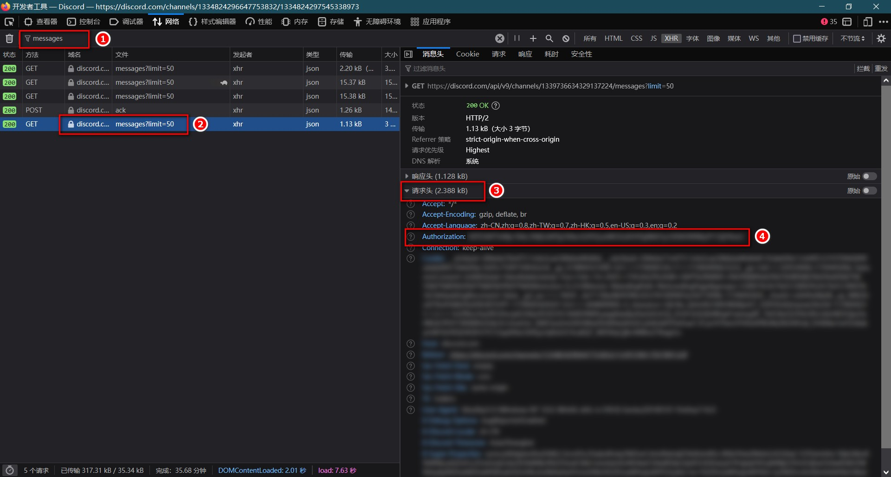

# Discord 转发配置 <Badge type="tip" text="1.2.0" />


## 创建机器人，获取Token
在 https://discord.com/developers/applications ，点击右上角 `New Application` 创建 Discord 应用程序



进入刚刚创建的应用程序后，点解侧边栏的 Bot 选项，可以随自己喜欢设置机器人头像和用户名（应用程序 和 机器人 都可以设置不同的头像与名称）



然后点击下方的 Reset Token 来获取Token，复制下来保存在安全的地方



Token 就像这样：
```
ABcdEfGhIJklMNopQRStUvWx.yz1234.ABcdEfGhIJklMNopQRStUvWxYZ1
```

::: info 注意事项
在重置机器人token时，可能出现速率限制：You are being rate limited

我也遇到过这种情况，换个梯子节点，多试几次应该就行了
:::

## 将机器人加入服务器
还是在刚才的页面，点击左侧 OAuth2 选项，往下翻找到 `OAuth2 URL Generator` ，在 `Scopes` 表单中选择 **bot**。



选择**bot**之后，在下方会出现 `Bot Permissions` 表单，选择 **SendMessages** （只给发送消息权限即可）



之后在页面最下方，会有机器人邀请链接，复制链接并访问，即可将机器人加入服务器（需要是群主）





如果想在自己不是群主的服务器添加机器人，建议和群主说明情况，将链接发给群主来完成机器人添加
::: tip 欢迎加入自己的 Discord 群组
Twebolg https://discord.gg/6pMkmMBnGH

小祥の小窝 https://discord.gg/93JRQbNbb2
:::

## 在 Tweblog 填写 Discord 转发配置
有三个数据要填
- **Authorization** ：将上面的得到的机器人Token填入，需要在前面加上 `Bot` + 空格，如：
    ```
    Bot ABcdEfGhIJklMNopQRStUvWx.yz1234.ABcdEfGhIJklMNopQRStUvWxYZ1
    ```
- **Guild Id** ： 服务器id
- **Channel Id** ：频道id


关于服务器id与频道id，就在 discord 的链接里
```
频道链接：
https://discord.com/channels/1334824296647753832/1334824297545338973
1334824296647753832 是服务器id（guildId）
1334824297545338973 是频道id（channelId）
```

转发推文时，效果是这样的



## 【歪门邪道】控制自己的账号来发送消息
通过开发者工具获得自己账号的Authorization，这样就可以控制自己的账号来发送消息，而不用使用机器人

::: danger 风险提示
这种做法是违反 Discord 服务条款的，或许会导致账户被封禁。

> https://discord.com/developers/docs/topics/oauth2#bot-vs-user-accounts
> 
> Developers must abide by the [terms of service](https://support-dev.discord.com/hc/articles/8562894815383-Discord-Developer-Terms-of-Service), which includes refraining from automating standard user accounts (generally called "self-bots") outside of the OAuth2/bot API.

如果不想挑战极限，还是使用机器人来发消息吧，使用机器人才是正确的做法。
:::

打开开发者工具，点击任意频道，搜索 messages，在请求头中找到 Authorization



Authorization 的值就像这样
```
ABcdEfGhIJklMNopQRStUvWxYZ.123456.ABcdEfGhIJklMNopQRStUvWxYZ1234567890AB
```

::: info 注意
这样获得的值，在填写转发配置中的 Authorization 时直接填即可（不需要再加上 `Bot` 了）


:::

