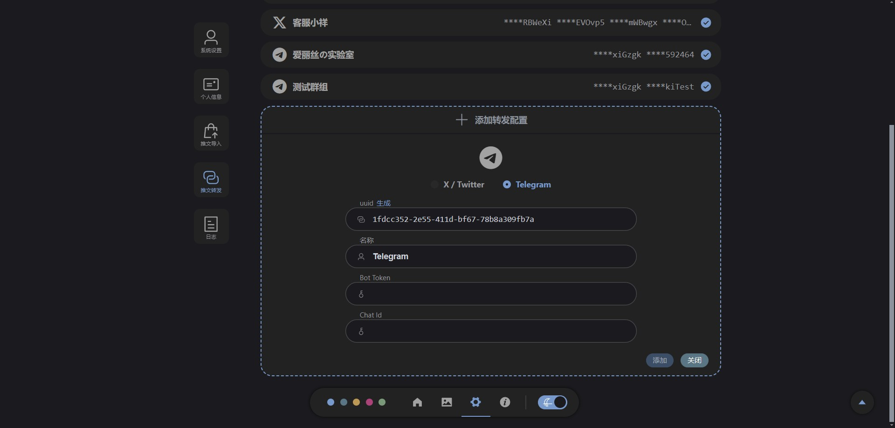
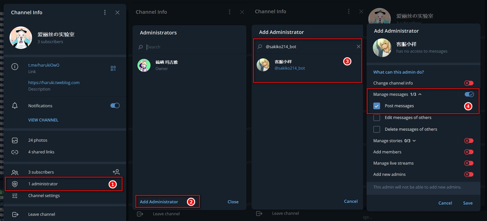
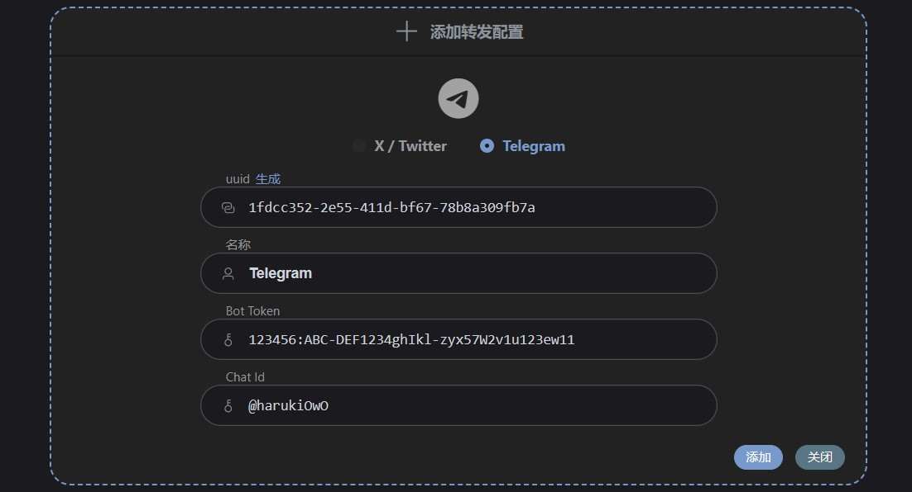

# Telegram 转发配置


## 创建 Telegram 机器人
官方文档： https://core.telegram.org/bots/features#creating-a-new-bot

在 Telegram 找到 [@botfather](https://t.me/botfather)，发送 `/newbot` 命令创建一个机器人， @botfather 会要求您提供名称和用户名，然后为您的新机器人生成身份验证令牌，就像这样：
```
123456:ABC-DEF1234ghIkl-zyx57W2v1u123ew11
```

::: info botfather 的更多功能
`/help` 可以查看所有命令，`/setuserpic` 可以为机器人设置头像
:::

## 将机器人加入自己的频道或群组
以下是加入频道的过程，搜索刚刚创建的机器人的用户名，来将其作为管理员加入频道，只给发送帖子权限即可



如果是加入群组的话，只作为成员加入即可

## 在 Tweblog 填写 Telegram 转发配置

将刚刚得到的机器人验证令牌填在 `Bot Token` ，将自己的频道名或群组名填在 `Chat Id` （注意要在前面加上 `@`）



添加之后记得要保存