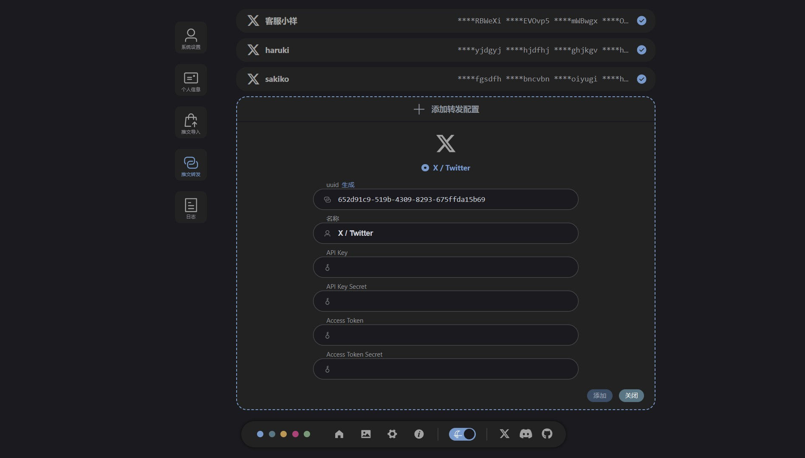
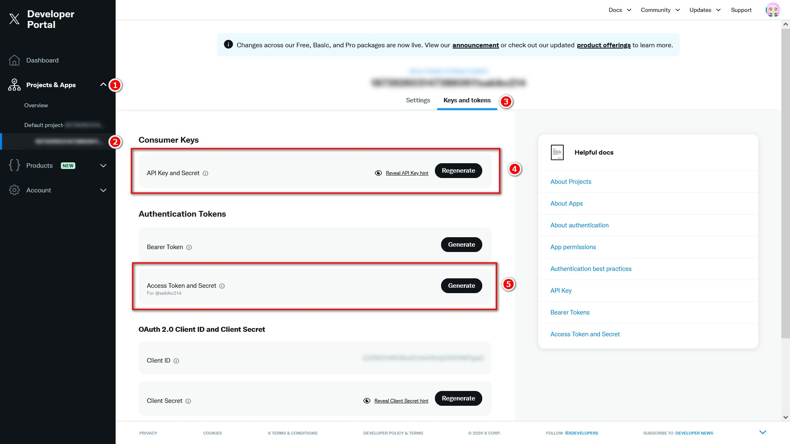

# X / Twitter 转发配置

## 访问 X 开发者网站
访问 X 开发者网站 https://developer.x.com/ （在此之前最好先在 X 登录）

向下滚动，点击 `Free` 中的 `Get started` 按钮

::: info 在到达下一个页面之前，可能会有这个页面闪过，虽然不知道怎么回事，但大概是正常现象

:::

## 创建 X 开发者账号
之后会跳转到这个页面，不用管其他的按钮，点击最下方的 `Sign up for Free Account` 创建免费账户

然后会跳转到这个页面，需要填写“开发者协议和政策”中的一项内容，描述自己将如何使用 Twitter 的数据和 API。

::: tip 这个随便写应该就行，可以和我填一样的：
I am developing an application to learn and utilize the functionality of sending tweets through the Twitter API. My primary use case is to programmatically send tweets from my application. This involves using Twitter's data to create and post tweets, allowing me to understand and implement the API's capabilities effectively. Additionally, I may explore other features of the API in the future, such as retrieving user profiles and analyzing tweet data, to enhance the functionality of my application.
:::

之后勾选所有条款，点击 `Submit` 即可完成创建 X 开发者账号

## 在开发者账号进行基本的设置
在如下界面中，点击 `Set up` 按钮进行设置

主要是进行 `App permissions` 应用程序权限设置，默认是 `Read` 需要改为 `Read and write`

其他的配置虽然是必填的，但是和推文转发功能没有关系，我也是随便填的

最后不要忘了点击 `Save` 保存

::: info 保存后会显示这个数据，但这个不是我们需要的，我们需要的要在下一步骤中获取
点击 `Done` 即可，不必保存，如果以后需要再重新生成就好

:::

## 生成 API 密钥和访问令牌等数据
在如下界面中，点击这两个红框中的按钮，依次生成所需数据

::: info API Key and Secret
- API Key
- API Key Secret

:::

::: info Access Token and Secret
- Access Token
- Access Token Secret

:::

::: warning 注意
如果忘记在上一步将 `App permissions` 应用程序权限设置为 `Read and write`，在设置过后需要重新生成Access Token and Secret

自己之前就因为这个情况被折磨了好久
:::

## 在 Tweblog 完成转发配置添加
利用上一步获取的数据，在转发配置页面添加转发配置

添加后，记得点击上方保存按钮

配置完成，可以试着测试转发效果

---

