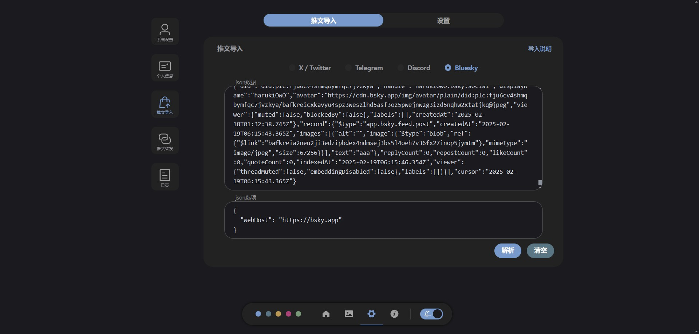
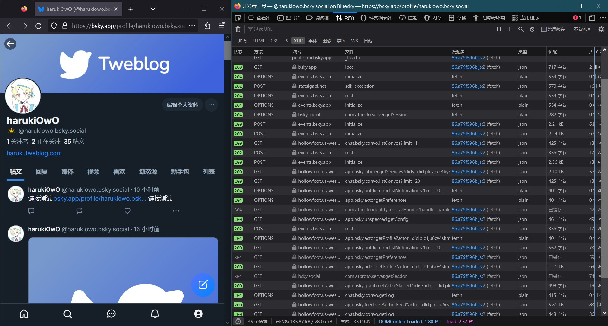
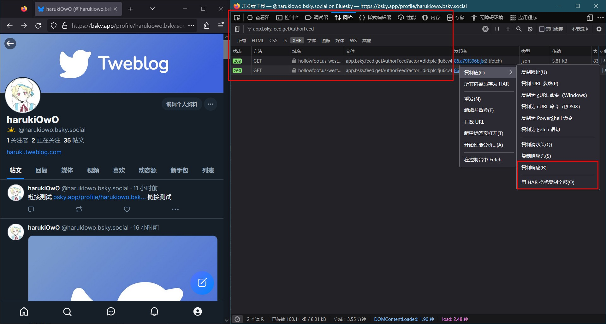
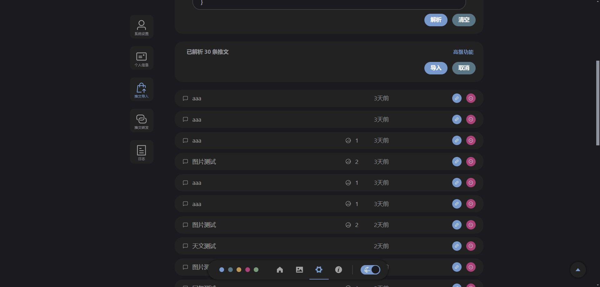

# Bluesky 导入说明 <Badge type="tip" text="1.3.0" />


## 进入开发者工具
在 bluesky 网页中，进入自己的个人资料，按 F12 打开开发者工具，然后刷新页面。



## 搜索 getAuthorFeed 请求
在开发者工具中的 网络监视器 中，搜索 `app.bsky.feed.getAuthorFeed`

然后可以用鼠标滚轮或键盘 `End` 键向下滚动，来获取更多数据



## 复制json数据
右键点击对应请求 **复制响应** 即可获取本请求所包含的数据。也可以在任意一条上右键点击并 用 HAR 格式复制全部 ，即可获取全部数据。

## 编写json选项
由于 bluesky 的 getAuthorFeed 中不包含网站地址，但拼接帖子链接时网站地址是必要的，所以需要编写json选项来指定网站地址。**也可以不填**，不填将默认为 `https://bsky.app`

json选项的类型
```ts
type JsonOptionType = {
    // 网站地址，如 https://bsky.app
    // 网址最后的斜杠加不加都没关系，如 https://bsky.app/
    webHost: string;
}
```

json选项示例
```json
{
    "webHost": "https://bsky.app"
}
```

## 在 Tweblog 进行导入
将 json数据 与 json选项 填入，点击解析


数据解析后，点击导入即可开始导入



