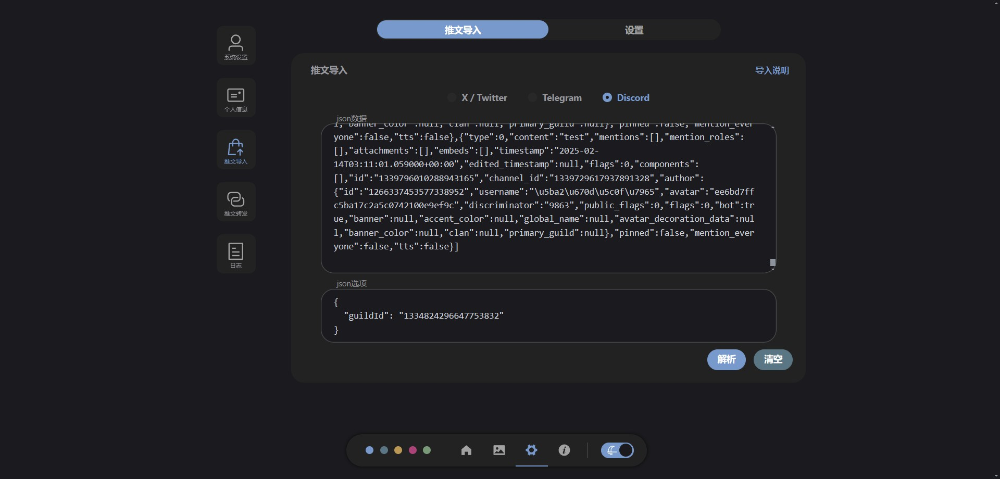
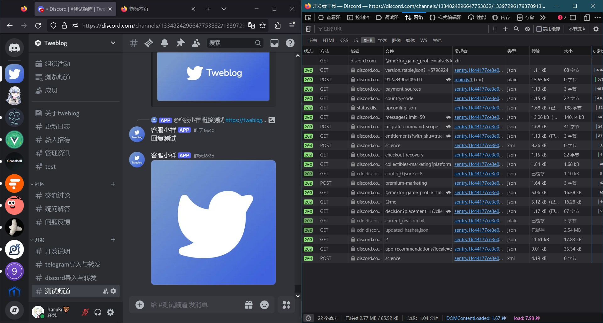
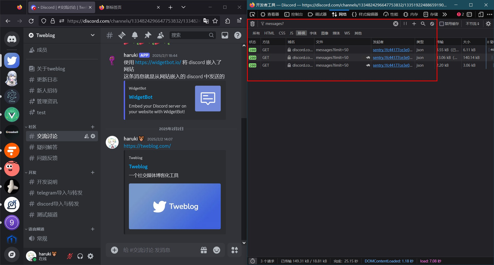
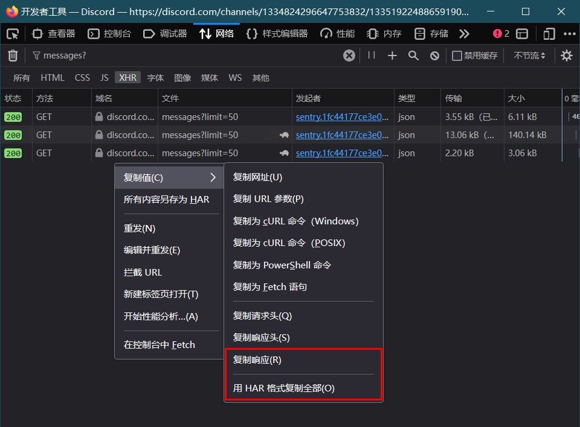
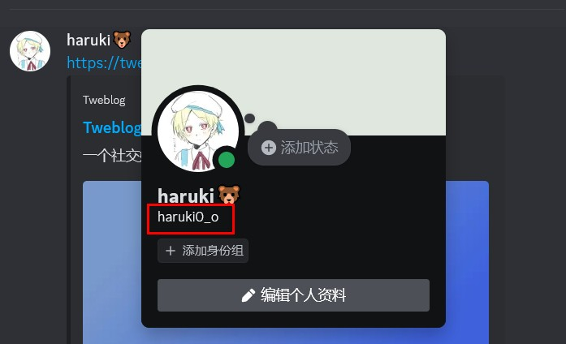
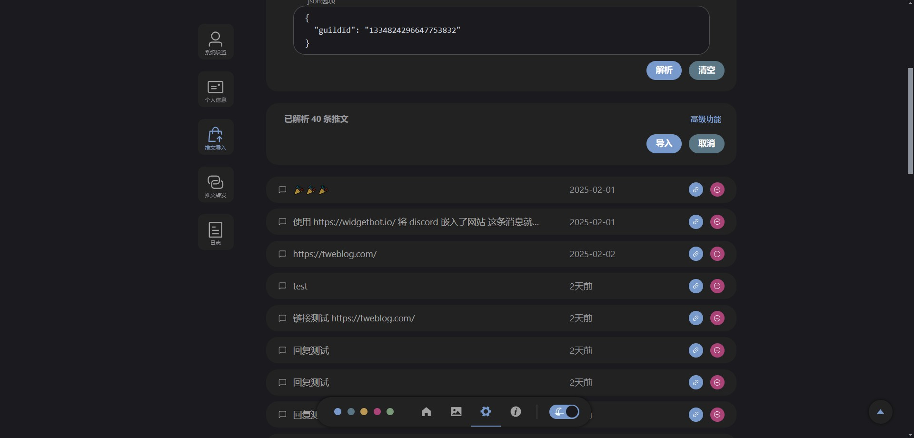

# Discord 导入说明 <Badge type="tip" text="1.2.0" />


## 进入开发者工具
在 discord 服务器中，进入要导入的频道，按 F12 打开开发者工具，然后刷新页面。



## 搜索 messages 请求
在开发者工具中的 网络监视器 中，搜索 `messages?`

可以用鼠标滚轮或键盘 `Home` 键向上滚动，来获取更多数据

此时也可以切换频道（不要切换服务器），来同时获取多个频道的 messages



## 复制json数据
右键点击对应请求 **复制响应** 即可获取本请求所包含的数据。也可以在任意一条上右键点击并 **用 HAR 格式复制全部** ，即可获取全部数据。



## 编写json选项
由于 discord 的 messages 中不包含服务器 id，但拼接消息链接时服务器id是必要的，所以需要编写json选项来指定服务器id。json选项还可以用来对消息发送者进行基本的过滤。

json选项的类型
```ts
type JsonOptionType = {
    // 服务器id
    guildId: string;
    // 包括的用户名，通过此数组来只选择某几个用户的消息，选填
    usernameIncludeList?: string[];
    // 排除的用户名，通过此数组来排除某几个用户的消息，不要和上面同时设置
    usernameExcludeList?: string[];
}
```

json选项示例
```json
{
    "guildId": "1334824296647753832",
    "usernameIncludeList": ["haruki0_o"]
}
```

关于服务器id，就在 discord 的链接里
```
频道链接：
https://discord.com/channels/1334824296647753832/1334824297545338973
1334824296647753832 是服务器id（guildId）
1334824297545338973 是频道id（channelId）

消息链接：
https://discord.com/channels/1334824296647753832/1334824297545338973/1335491846549536860
1334824296647753832 是服务器id（guildId）
1334824297545338973 是频道id（channelId）
1335491846549536860 是消息id（messageId）
```

关于用户名，指的是这个 `haruki0_o`



## 在 Tweblog 进行导入
将 json数据 与 json选项 填入，点击解析


数据解析后，点击导入即可开始导入

