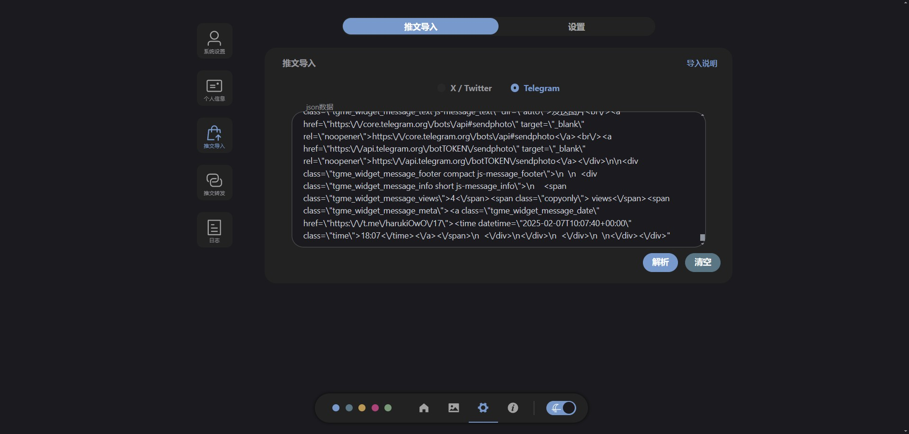
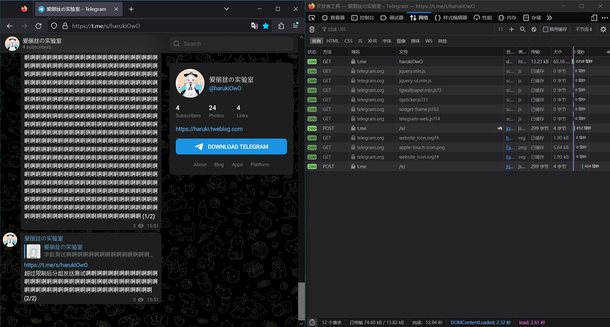
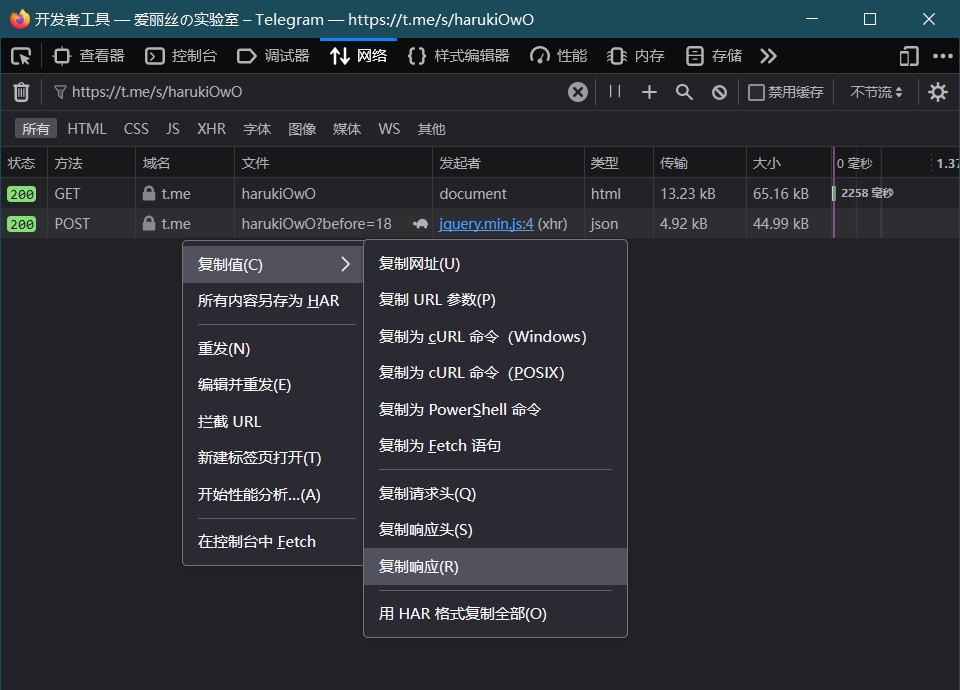
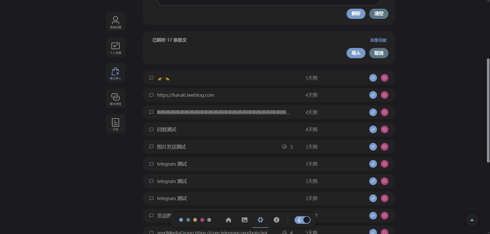

# Telegram 导入说明 <Badge type="tip" text="1.1.0" />


## 进入开发者工具
在 Telegram 频道网页中，按 F12 进入开发者工具，然后刷新页面。



## 搜索自己的频道链接
在开发者工具中的 网络监视器 中，搜索自己的频道链接，如：
```
https://t.me/s/harukiOwO
```

之后可以用鼠标滚轮或键盘`Home`键向上滚动，来获取更多数据



## 复制响应
上面的 GET 与 POST 请求都包含着帖子内容。右键点击对应请求 **复制响应** 即可获取本请求所包含的数据。也可以在任意一条上右键点击并 **用 HAR 格式复制全部**，即可获取全部数据。

之后粘贴到推文导入页面的文本域中，即可解析并导入



