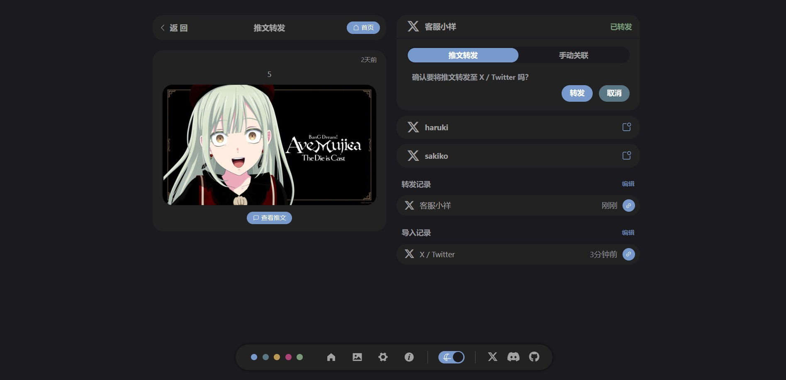

# 推文转发


## 转发配置
想要转发推文，需要提前准备转发配置


::: tip 转发配置说明: 
- [X / Twitter](./forward/x-twitter.md)
:::


## 进入转发页面
点击推文卡片右下方绿色按钮，即可进入转发页面


## 转发推文
选择对应转发配置，转发推文


---


---


## 回复转发
推文的回复在转发时，会自动回复至已转发的父推文

::: warning 注意顺序
转发时请先转发父帖，再转发子帖
:::

::: info 特性说明
**以下是优先级从高到低的顺序**

- 如果父帖**被转发**（有转发记录），且某个转发记录中的 `转发配置uuid` 与当前指定的 `转发配置` **相同**，则会回复至此父帖（根据转发记录中保存的 `帖子在X等平台的id`）

- 如果父帖**被转发**，但**没有**转发记录与当前指定的 `转发配置` 相同，则退而求其次在转发记录中寻找 `平台标识` 与当前指定的 `转发配置（的平台标识）` 相同的（日期新的优先），找到则回复至其

- 如果父帖**被导入**，则在导入记录中寻找 `平台标识` 与当前指定的 `转发配置（的平台标识）` 相同的（日期新的优先），找到则回复至其

- 如果父帖**未被转发**也**未被导入**，则转发子帖会在对应平台创建单独的帖子


具体逻辑见 `tweet-blog-hono: src\services\post-control\control-forward\forward-post\services.ts` 中的 `findParentPostSamePlatformPostId` 函数

[转发配置与转发记录的解释](#删除无对应转发配置的记录)
:::


---


---


## 自动转发 <Badge type="tip" text="0.0.2" />

在自动转发页面，将显示每个转发配置对应的条目，右侧显示已转发的个数和总推文个数


点击任意条目后，将展开自动转发设置表单，点击开始即可启动自动转发


关于转发任务，设计上和 [导入任务](./tweet-import.md#任务中止) 是一致的

::: info 特性说明
- **关于转发个数** 在顺序为 **从新到旧** 时启动后，在任务中显示的个数可能会比之前指定要多，这是正常现象

因为在顺序为 **从新到旧** 时会进行特殊的处理，会寻找所有子帖的未转发的父帖，并在转发子帖之前优先转发父帖，以此保证推文转发的完整性

- **关于推文总数** 可能和首页显示的不一致，首页的推文个数包含了回收站中的推文，而这里是不包含的

:::

::: warning X 存在速率限制
X 免费的账户24小时内只能发送17条推文，所以建议在自动转发时将转发间隔设置为2小时左右


出现速率限制的问题时，日志中会有 Error: Request failed with code 429
:::


## 转发记录设置 <Badge type="tip" text="0.0.2" />


### 删除无对应转发配置的记录 <Badge type="tip" text="转发配置与转发记录的解释" />

在数据库中，每一条转发记录都保存有其 `转发配置uuid`。而 `转发配置` 的详细信息则是保存在 `data/forward.json` 中。

```prisma
// tweet-blog-hono: prisma\schema.prisma
// 数据库中的转发记录
model PostForward {
  id              String   @id @default(uuid())
  // 平台标识，如 'X'
  platform        String
  // 帖子在X等平台的id
  platformPostId  String
  link            String
  forwardAt       DateTime @default(now())
  // 转发配置uuid
  forwardConfigId String
  post            Post     @relation("PostForwards", fields: [postId], references: [id], onDelete: Cascade)
  postId          String
}
```

如果删除了某个 `转发配置` ，其转发记录还是有的。点击此选项，将删除那些 `转发配置uuid` 所对应的 `转发配置` 已不存在的转发记录。

不过即使删除了 `转发配置`，还是不建议使用此功能删除转发记录。如果被转发的推文又被导入，转发记录缺失会导致推文被重复创建

### 删除全部推文/图片转发记录
如果不是特殊情况，请不要删除，否则会导致 推文/图片 多次创建的问题