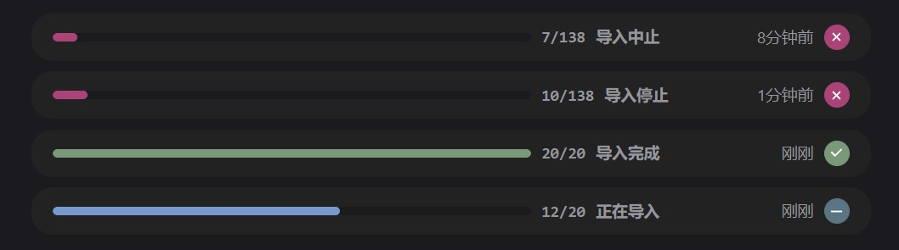

# 推文导入

## 功能原理
主要的业务逻辑是在前端，前端对 JSON 数据进行解析，将整理后的数据发送至后端。不管从哪个平台导入，后端接收的数据结构是一样的。

后端将请求获取数据中的图片，处理后与数据中的其他内容一同保存在数据库。

## 获取 JSON 数据
JSON 数据一般需要通过 F12 开发者工具获取，这里以推特为例。

::: info 从更多平台导入，请参考：
- [X / twitter](./import/x-twitter)
- [Telegram](./import/telegram)
- [Discord](./import/discord)
:::

1. 进入个人主页，按 F12 进入开发者工具，然后刷新页面。

2. 在开发者工具中的 **网络监视器** 中，搜索 `UserTweets`。

3. 找到相关请求后，右键点击并选择 **复制值** -> **复制响应**，即可获取所需的 JSON 数据。

::: tip 小技巧
可以按下鼠标中键（或按键盘上的 `End` 键），在个人主页向下滚动，即可获取更多的 `UserTweets` 响应

依次复制 JSON 数据，并点击解析，即可一次性导入更多的推文

0.0.2 版本后，支持 [批量导入](#批量导入)
:::

## 导入推文
1. 将获取到的 JSON 数据粘贴到推文导入页面的文本域中。

2. 点击 **解析** 按钮，前端会解析出推文内容，可以预览或移除。

3. 确认无误后，点击 **导入** 按钮开始导入推文。导入过程需要一些时间，进度会在导入界面显示。

::: tip 不必担心重复导入
推文导入时，会记录在各平台的id，以此避免推文被创建多个

当推文被重复导入时，会用新的数据更新，并添加导入记录
:::

::: warning 导入过程中请勿关闭服务器
在导入期间关闭页面是可以的，但请不要关闭服务器，否则导入将中断。
:::

## 批量导入 <Badge type="tip" text="0.0.2" />
获取到多条 `UserTweets` 响应后，可以在随意一条上点击右键 **复制值** -> **用 HAR 格式复制全部**

再将得到的内容复制到推文导入文本域，点击解析即可批量解析推文

## 高级功能 <Badge type="tip" text="0.0.2" />
点击导入确认框右上角的高级功能，将会展开 **在导入的同时关联至转发记录** 选项

在导入的同时关联至转发记录，目的是为了便于 [自动转发](./tweet-forward.md#自动转发) 功能。

如果 **不启用** 此功能，将推文导入后是没有转发记录的，而自动转发功能将会转发没有转发记录的推文。  
这样的话如果在自动转发页面不小心启动了 `haruki🐻`（对应转发配置） 的自动转发，会将从 `haruki🐻` 导入的推文再次转发至 `haruki🐻` 账号。

如果 **启用** 此功能，将在导入的同时关联至转发记录，则不会导致上述问题。  
进行关联后，你将在 `自动转发` 页面发现对应 `转发配置` 的已转发个数变多，这就是此功能的效果。

::: warning 注意：请确认 `转发配置` 与导入的推文对应正确
批量关联后，暂时还没有办法方便地批量解除关联，所以在关联前请确认所选的 `转发配置` 正确
:::

::: info 特性说明
为了尽可能帮助用户保证关联的 `转发配置` 正确，后端在处理关联前将会对比 `转发配置` 和导入的推文的所属平台，如果不一致将会放弃关联

不必担心重复关联转发记录，对应 id（X等平台中的帖子id）的转发记录只会被创建一次，再次关联时只会更新数据
:::

## 任务中止 <Badge type="tip" text="0.0.2" />
如果在开始导入后想放弃导入，或者是发现导入长时间不进行（因为图片将请求获取，可能需要 [配置代理](./system-config.md#代理配置)），可以点击对应任务右侧的 `横线` 按钮进行中止

::: info 任务状态一览

- **aborted** 中止：用户手动进行的中止
- **stopped** 停止：由于后端关闭导致的停止
- **completed** 已完成
- **running** 运行中

任务完成后，点击对勾或叉叉的效果都是删除此任务记录

在 [自动转发](./tweet-forward.md#自动转发) 的任务中，和这里的设计是一致的
:::

## 导入设置

### 删除重复的导入记录
将会在所有推文（与图片）中，删除像这样重复的导入记录

### 删除全部推文/图片导入记录
如果不是特殊情况，请不要删除，否则会导致 推文/图片 多次创建的问题

