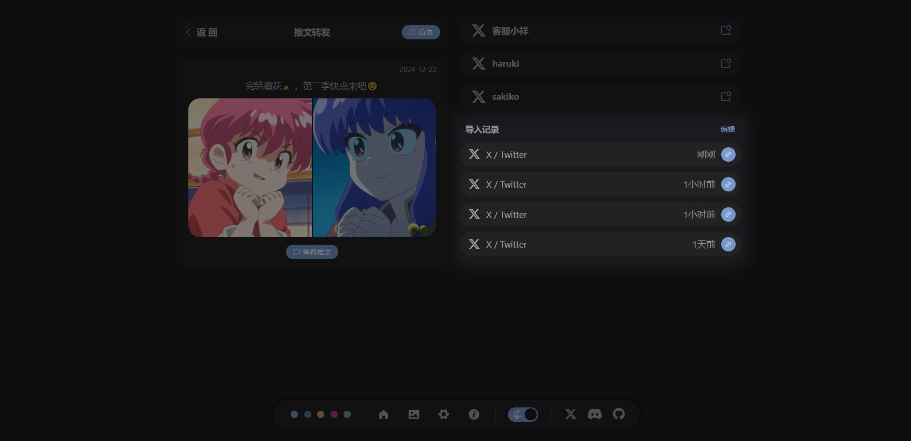

# 推文导入

## 功能原理
主要的业务逻辑是在前端，前端对 JSON 数据进行解析，将整理后的数据发送至后端。不管从哪个平台导入，后端接收的数据结构是一样的。

后端将请求获取数据中的图片，处理后与数据中的其他内容一同保存在数据库。

## 获取 JSON 数据
JSON 数据一般需要通过 F12 开发者工具获取，这里以推特为例。

1. 进入个人主页，按 F12 进入开发者工具，然后刷新页面。

2. 在开发者工具中的 **网络监视器** 中，搜索 `UserTweets`。

3. 找到相关请求后，右键点击并选择 **复制值** -> **复制响应**，即可获取所需的 JSON 数据。

::: tip 小技巧
可以按下鼠标中键，在个人主页向下滚动，即可获取更多的 `UserTweets` 响应

依次复制 JSON 数据，并点击解析，即可一次性导入更多的推文
:::

::: info 从更多平台导入，请参考：
- [X / twitter](./import/x-twitter.md)
:::

## 导入推文
1. 将获取到的 JSON 数据粘贴到推文导入页面的文本域中。

2. 点击 **解析** 按钮，前端会解析出推文内容，可以预览或移除。

3. 确认无误后，点击 **导入** 按钮开始导入推文。导入过程需要一些时间，进度会在导入界面显示。

::: tip 不必担心重复导入
推文导入时，会记录在各平台的id，以此避免推文被创建多个

当推文被重复导入时，会用新的数据更新，并添加导入记录
:::

::: warning 导入过程中请勿关闭服务器
在导入期间关闭页面是可以的，但请不要关闭服务器，否则导入将中断。
:::

## 导入设置

### 删除重复的导入记录
将会在所有推文（与图片）中，删除像这样重复的导入记录

### 删除全部推文/图片导入记录
如果不是特殊情况，请不要删除，否则会导致 推文/图片 重复导入的问题

