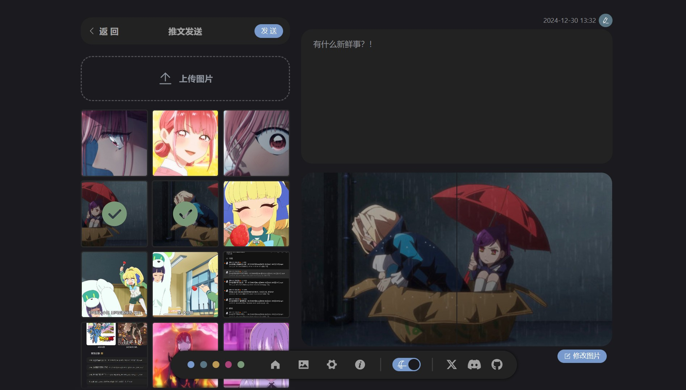
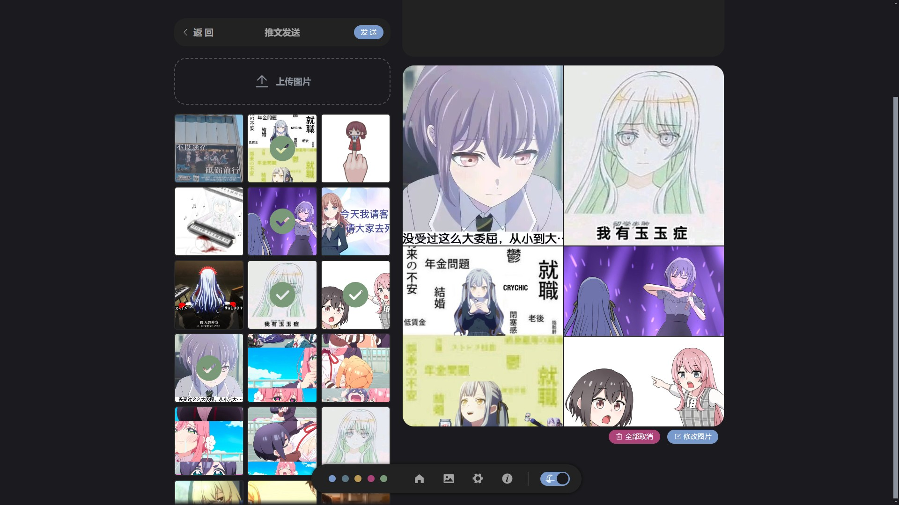
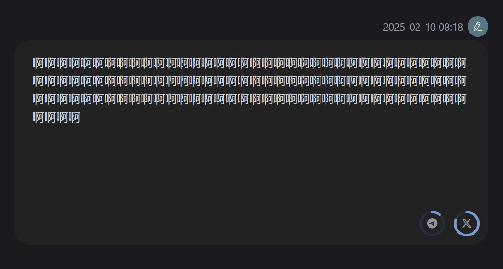

# 推文发送

---

## 图片选择数量 <Badge type="tip" text="1.1.0" />
自 [1.1.0](../changelog#110) 版本后，在发送推文时可以选择超过 4 个图片，最大的限制是 40 个，不过真的不建议一次发这么多。

## 字数限制提示 <Badge type="tip" text="1.1.0" />
在输入框输入文字时，右下角会显示各个平台的字数限制提示，仅仅是作为提示，Tweblog 并不会限制字数。

::: tip 超过限制时的转发方式
对于超过对应平台字数或图片数量限制的推文，在转发时会以 [串联回复](./tweet-forward#串联回复) 的方式发送全部内容
:::