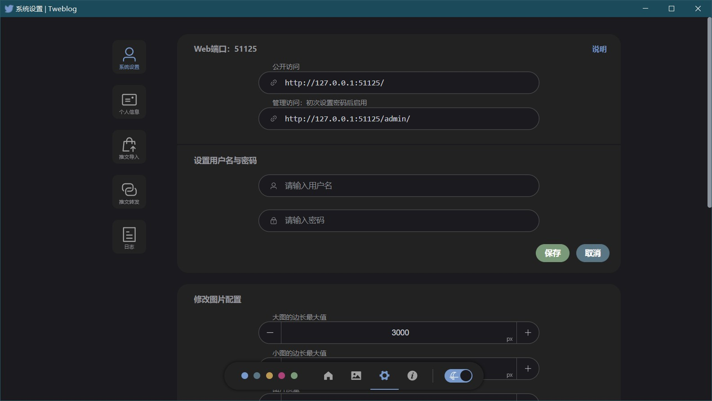

# 快速开始

Tweblog 现在拥有 **桌面版** 和 **Web版**

## 桌面版

**Github：** https://github.com/haruki1953/Tweblog

Tweblog 所有的版本更新都在 Github 以 release 形式发布，可在此处获取最新的压缩包，解压即用
- https://github.com/haruki1953/Tweblog/releases

理论上是支持 Windows、Linux、Mac 的，但是自己现在只成功打包了 Windows 版，其他的让我再琢磨琢磨

::: tip 关于 Tweblog
对 Tweblog 还不了解？看看 [什么是 Tweblog](./what-is-tweblog)

桌面版的更多信息，在这里查看 [桌面版](./desktop)
:::

### 在手机上使用

Tweblog 桌面版其实就是用 electron 对Web版进行了浏览器套壳，但这样也能发挥出Web版最大的优势：跨设备远程控制



在局域网内，可以通过电脑的 IP地址 + Web端口 ，在手机或其他设备的浏览器中访问。

::: info 固定电脑的IP地址
为了使访问更方便建议在其他设备中收藏地址，这样的话有一点需要注意，必须固定电脑的IP地址。有多种方法可以设置，比较方便的是在路由器中设置，关键词是 `DHCP服务`
:::

## Web版

**DockerHub：** https://hub.docker.com/r/harukiowo/tweblog

目前只能用 docker 部署 Tweblog Web版，部署前请确认已经安装了 [docker](https://docs.docker.com/)

为了保证 Tweblog 在每次更新之后数据不丢失，请准备好保存数据的文件夹。
```sh
mkdir -p ${HOME}/Tweblog/data
cd ${HOME}/Tweblog
```

### 使用 docker 部署 Tweblog
运行以下命令
```sh
docker run -d \
	--name Tweblog \
	-v ${HOME}/Tweblog/data:/app/data \
	-p 51125:51125 \
	--restart unless-stopped \
	harukiowo/tweblog:1.1.0
```

::: tip 更多部署说明
如果有网络问题或其他问题，在这里查看更多部署说明：[部署](./deploy.md)
:::

部署完成后，使用命令查看日志
```sh
docker logs Tweblog
```

输出以下内容，部署成功
```
  ========================================
              Tweblog 已启动
  ========================================
  
  公开访问: http://127.0.0.1:51125/
  
  管理访问: http://127.0.0.1:51125/admin/
  默认用户名: admin
  默认密码: adminadmin

  https://tweblog.com/
  https://github.com/haruki1953/Tweblog
  
  ========================================
```
::: info 注意
日志中如果没有信息，可能需要再等待几秒（并重新执行日志查看命令），数据库初始化需要一点时间
:::

### 开始使用
访问位于 `/admin/` 路径的管理页面，使用默认用户名与密码登录

::: warning 项目部署后，第一要务是修改用户名与密码
在管理页面中，点击屏幕下方控制条中的设置按钮，进入系统设置页面修改用户名与密码

常见问题：[忘记密码](faq.md#忘记密码)
:::

关于 `/` 根路径的公开页面，任何访问的用户都能通过这个页面浏览推文
