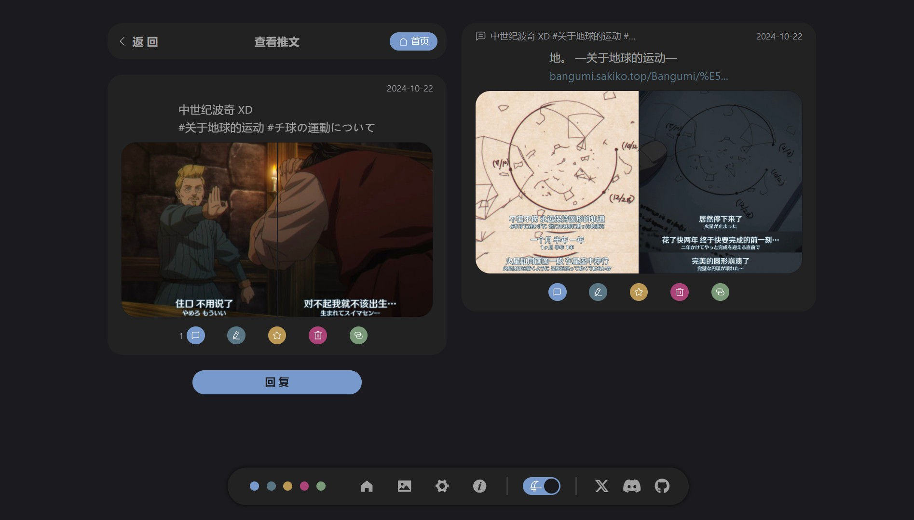
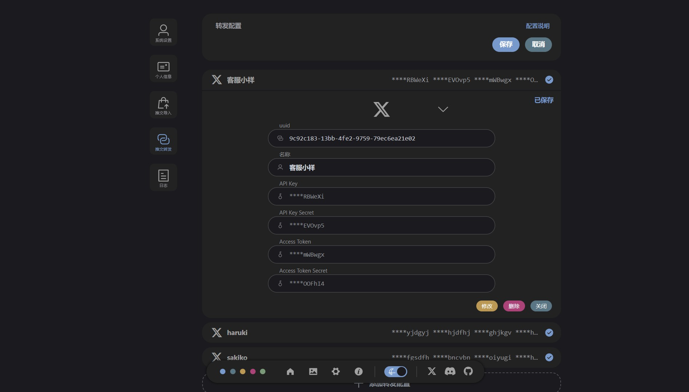
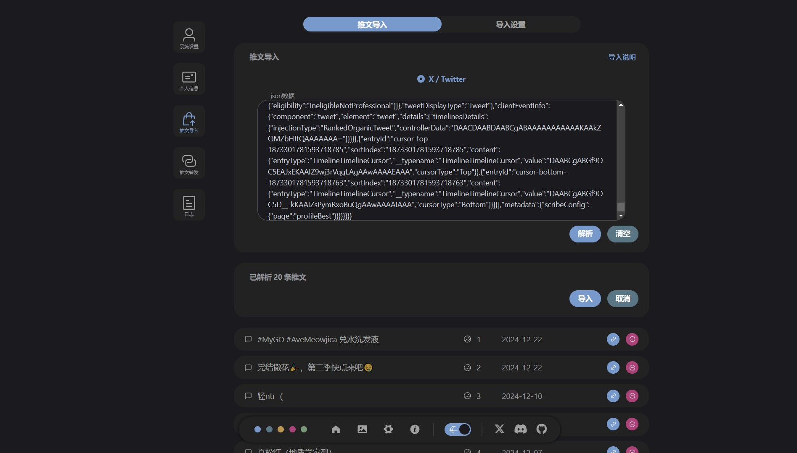

---

---

# 什么是 Tweblog

是一个自部署的微博客，目的是为了方便同时运营多个社交媒体，自己也在打算用这个从推特出逃。

::: tip 快速开始
想开始尝试？跳到 [快速开始](./getting-started)
:::

## 功能

- 基本功能：发送推文、图片、回复……

- 支持从推特导入推文

- 配置后，可将推文转发至推特

- 对于其他平台的导入和转发（锐意制作中）

## 预览

---

---

---

---

---

